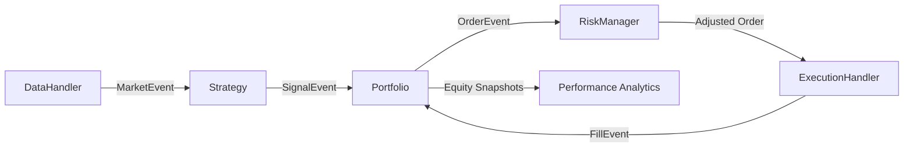

# Quant Trading Platform

An **event-driven algorithmic trading engine** built in Python — designed for backtesting quantitative strategies on historical market data with a modular, extensible architecture.

## Architecture



All components communicate through an event queue, making the system fully decoupled and extensible.

## Project Structure

```
quant_trading_platform/
├── src/
│   ├── events.py          # Event hierarchy (frozen dataclasses + Enums)
│   ├── data.py            # DataHandler — CSV drip-feed, no look-ahead bias
│   ├── strategy.py        # 3 strategies: MA Cross, Bollinger Band, RSI
│   ├── portfolio.py       # NaivePortfolio — position & equity tracking
│   ├── execution.py       # SimulatedExecutionHandler — slippage + commission
│   ├── performance.py     # Sharpe, Sortino, drawdown, Calmar, win rate
│   └── risk.py            # Position limits, vol sizing, drawdown breaker
├── tests/                 # pytest suite (events, strategies, portfolio, integration)
├── data/                  # CSV market data (synthetic or real via yfinance)
├── notebooks/             # Strategy analysis notebooks
├── download_data.py       # Yahoo Finance data downloader
├── generate_data.py       # Synthetic OHLCV generator (random walk)
├── main.py                # CLI backtest entry point with argparse
└── requirements.txt       # Dependencies
```

## Quick Start

```bash
# 1. Install dependencies
pip install -r requirements.txt

# 2a. Download real market data (recommended)
python download_data.py --symbols AAPL GOOG --start 2020-01-01

# 2b. OR generate synthetic data
python generate_data.py

# 3. Run a backtest
python main.py --strategy ma_cross
python main.py --strategy bollinger
python main.py --strategy rsi

# 4. Run tests
python -m pytest tests/ -v
```

## Strategies

| Strategy | Type | Signal Logic |
|----------|------|-------------|
| **MA Crossover** (`ma_cross`) | Trend-following | Golden/death cross on 50/200 SMA |
| **Bollinger Bands** (`bollinger`) | Mean reversion | Price crossing ±2σ bands around 20-day SMA |
| **RSI Momentum** (`rsi`) | Momentum | RSI(14) crossing 30/70 thresholds |

## Performance Analytics

After every backtest, the engine automatically computes:

| Metric | Description |
|--------|-------------|
| **Sharpe Ratio** | Risk-adjusted return (annualised, rf = 2%) |
| **Sortino Ratio** | Downside-risk-adjusted return |
| **Max Drawdown** | Largest peak-to-trough decline (% and duration) |
| **Calmar Ratio** | Annualised return / max drawdown |
| **Win Rate** | % of trades with positive P&L |
| **Profit Factor** | Gross profit / gross loss |
| **Avg Win/Loss** | Average winning trade / average losing trade |
| **Benchmark** | Buy-and-hold comparison per symbol |

## Risk Management

The `RiskManager` enforces three layers of protection:

1. **Position Limits** — caps single-position value at 20% of equity (configurable)
2. **Volatility-Based Sizing** — scales position size inversely with realised vol
3. **Drawdown Circuit Breaker** — blocks new BUY orders if drawdown exceeds 15%

## CLI Options

```bash
python main.py \
  --strategy rsi \
  --symbols AAPL MSFT GOOG \
  --capital 200000 \
  --slippage 0.001 \
  --commission-type fixed \
  --commission 1.00 \
  --max-position-pct 0.20 \
  --max-drawdown-pct 0.15 \
  --log-level INFO
```

## Sample Output

```
═══════════════════════════════════════════════════════════════
  PERFORMANCE REPORT
═══════════════════════════════════════════════════════════════
  Initial Capital      : $  100,000.00
  Final Equity         : $  224,789.99
  Total Return         :      124.79%
  Annualised Return    :       22.83%
  Annualised Volatility:       31.45%
──────────────────────────────────────────────────────────────
  Sharpe Ratio         :      0.6627
  Sortino Ratio        :      0.9142
  Calmar Ratio         :      1.2381
──────────────────────────────────────────────────────────────
  Max Drawdown         :      -18.43%
  Max DD Duration      :       87 bars
──────────────────────────────────────────────────────────────
  Total Trades         :          6
  Win Rate             :       66.67%
  Profit Factor        :      4.2310
  Avg Win/Loss Ratio   :      2.1155
  Total Commission     : $        6.00
──────────────────────────────────────────────────────────────
  Benchmark (Buy & Hold):
    AAPL               :       47.23%
    GOOG               :       31.88%
═══════════════════════════════════════════════════════════════
```

## Key Design Decisions

- **No look-ahead bias** — generator-based data drip-feed ensures strategies only see past data
- **O(1) strategy windows** — `collections.deque(maxlen=...)` for sliding-window computations
- **Slippage modelling** — adverse price adjustment on every fill (configurable %)
- **Configurable commission** — fixed ($/trade) or variable (% of notional)
- **Immutable events** — frozen dataclasses with validation in `__post_init__`
- **Full audit trail** — every position and holding snapshot is recorded for analysis
- **Risk controls** — position limits, vol sizing, and drawdown circuit breakers

## Tech Stack

Python 3.10+ · Pandas · NumPy · Matplotlib · yfinance · pytest · dataclasses · ABC
